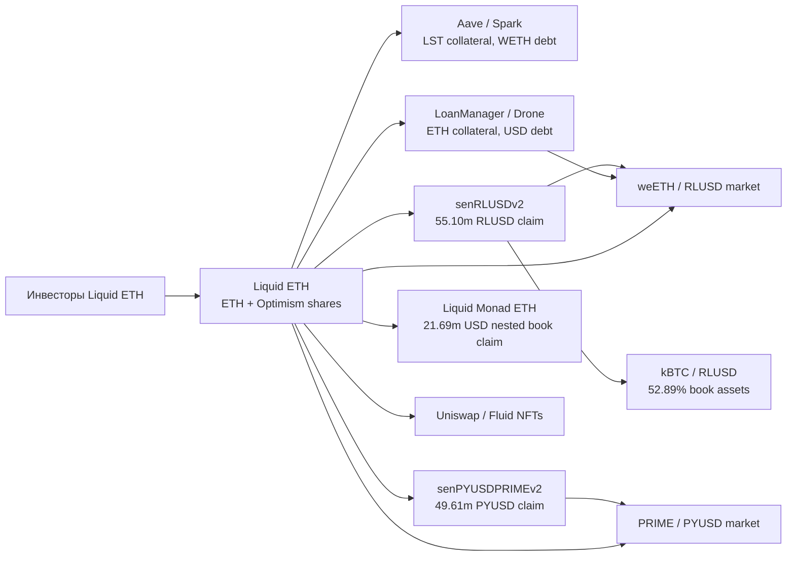
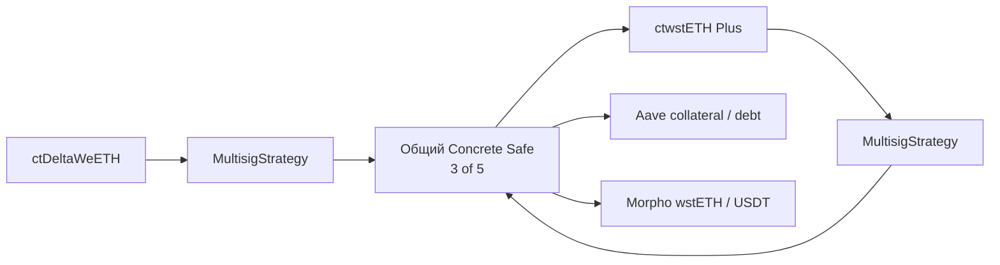

# Карта требований, кредитов и общего backing

Это карта проверенных выбранных продуктов на T, не законченный netting всего ETH рынка. Edges означают ownership/control, lending или contractual claim; они не доказывают отдельный внешний депозит и не всегда являются историческим денежным переводом.

Investor arrow обозначает экономическую роль, а не complete holder scan. RLUSD и PYUSD claims используют stablecoin-at-par assumptions. Self-credit возникает, когда контролируемый borrower занимает на рынке, в который investor уже вложился через принадлежащий ему carry vault. Borrow interest partly возвращается тому же инвестору; отсюда нужна net cash-flow арифметика после fees, а не сумма income обоих sides.

Safe владеет всем ctwstETH Plus supply. Поэтому внешний equity этого продукта не выводится из `totalAssets` без provenance владельцев и underlying allocation. Aave/Morpho assets Safe также не полностью распределены между двумя depicted vaults. Весь ctDelta supply держит иной единственный адрес; его ultimate beneficial owner не установлен.

Файлы `data/eth/dependency_graph.json` и `carry_credit_lookthrough.json` сохраняют источники, тип каждой связи и запрет использовать amount как additive market capital. Граф включает конкретные Solidity getter proofs; flow до внебиржевого кредитного плательщика остается disclosure-based, не blockchain proof юридических требований.

Для всех сетей нужно вести три адресных слоя: root backing, deployment location, circulation location. Bridge lock/mint создаёт remote claim на L1 escrow; burn/mint переносит circulation. Оба процесса могут сосуществовать в одном продукте. Их сумма без asset-level keys и in-flight ledger недопустима.

Current symbol universe служит поиском. Проверка native/receipt asset требует `(chain,address,version)` identity, conservation rules и redemption path. Датированный protocol API может помечать `misrepresentedTokens=true`: например ether.fi Liquid adapter распределяет synthetic eETH/WETH balances по внутреннему category accounting. Такие token rows не являются физическим балансом eETH/WETH кошелька.

До полного graph нельзя дать одно защищаемое unique-underlying или external-equity число по всем сетям. Отдельные подсуммы book claims, oracle-valued accounts, gross pool TVL и native backing сохраняются в разных views. Неразрешённая связь не становится нулём или полностью внешним депозитом по умолчанию.
