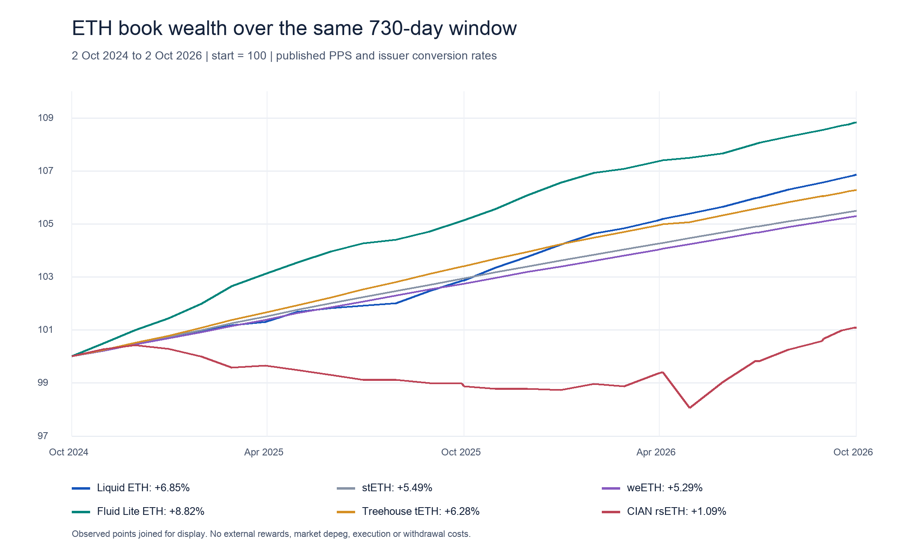

# История рынка и дохода ETH

Окно wealth: 2 октября 2024, 23:59:59 UTC — T. 24 закрытых месячных среза охватывают октябрь 2024–сентябрь 2026. Исторические observations описывают опубликованные balances и PPS; они не являются полной реконструкцией всех существовавших продуктов.

## Сопоставимый результат инвестора в ETH

Начальная стоимость каждой позиции — 100 ETH-equivalent units. Цена ETH/USD не влияет на график. Fluid уже denominated в rebasing stETH; дополнительное умножение на wstETH rate дало бы double count. Treehouse IAU конвертирован через исторически проверенный wstETH underlying; CIAN rsETH — через проверенный issuer oracle. Результат не включает отдельно выплаченные rewards, slippage, withdrawal fee, depeg и private distributions.

| Продукт | 730 дней, % | Первый год, % | Последний год, % | Annualized 730 дней, % |
|---|---:|---:|---:|---:|
| Liquid ETH | 6.8501 | 2.8691 | 3.8700 | 3.3683 |
| stETH | 5.4875 | 2.9362 | 2.4785 | 2.7071 |
| weETH | 5.2947 | 2.7436 | 2.4830 | 2.6132 |
| Fluid Lite ETH | 8.8243 | 5.1346 | 3.5096 | 4.3189 |
| Treehouse tETH | 6.2761 | 3.3969 | 2.7845 | 3.0903 |
| CIAN rsETH | 1.0854 | -1.1346 | 2.2455 | 0.5413 |

Рейтинг меняется между первым и вторым годом. Прирост токенов на долю и доход в ETH — разные величины; negative receipt return способен сосуществовать с positive ETH conversion return. Сравнение PPS говорит о результате учёта, но не объясняет его причину. Для attribution нужны позиции, fees и внешние выплаты во времени.

## История 25 крупнейших наблюдаемых протоколов

Ниже ETH-family USD observations по API, без суммирования строк. Первая доступная точка внутри окна не всегда равна октябрю 2024. Дата начала истории способна отражать launch/migration/adapter change; missing не означает ноль. USD-изменение смешивает цену ETH, flow и methodology. Поле ETH units показано только для прямого токена ETH и не отражает всех receipts.

| Протокол | Первая точка | USD млн | Сентябрь 2026, USD млн | Изменение USD, % | Месяцев с данными / 24 |
|---|---|---:|---:|---:|---:|
| Lido | 2024-10 | 26024.51 | 26371.34 | 1.33 | 24 |
| Binance staked ETH | 2024-10 | 4179.76 | 9959.20 | 138.27 | 24 |
| Aave V3 | 2024-10 | 7923.20 | 9777.67 | 23.41 | 24 |
| EigenCloud | 2024-10 | 11256.27 | 6990.47 | -37.90 | 24 |
| ether.fi Stake | 2024-10 | 5639.62 | 5124.99 | -9.13 | 24 |
| SparkLend | 2024-10 | 2642.43 | 4106.81 | 55.42 | 24 |
| Sky Lending | 2024-10 | 3821.54 | 1654.16 | -56.71 | 24 |
| Morpho Blue | 2024-10 | 295.04 | 1432.97 | 385.68 | 24 |
| Rocket Pool | 2024-10 | 2000.46 | 1393.00 | -30.37 | 24 |
| JustLend V1 | 2024-10 | 10.72 | 1298.99 | 12012.18 | 24 |
| Kelp | 2024-10 | 234.62 | 1121.41 | 377.96 | 24 |
| StakeWise V3 | 2024-10 | 353.89 | 1003.93 | 183.68 | 24 |
| Concrete | 2025-02 | 2.98 | 941.00 | 31526.51 | 20 |
| Compound V3 | 2024-10 | 682.04 | 713.73 | 4.65 | 24 |
| mETH Protocol | 2024-10 | 1282.88 | 629.25 | -50.95 | 24 |
| Coinbase Wrapped Staked ETH | 2024-10 | 519.15 | 507.07 | -2.33 | 24 |
| ether.fi Liquid | 2024-10 | 868.94 | 397.62 | -54.24 | 24 |
| Curve DEX | 2024-10 | 425.69 | 266.95 | -37.29 | 24 |
| Aave V4 | 2026-03 | 0.91 | 232.94 | 25621.20 | 7 |
| Stader | 2024-10 | 356.77 | 239.80 | -32.79 | 24 |
| Fluid Lending | 2024-10 | 331.91 | 234.05 | -29.49 | 24 |
| Fluid Lite | 2024-10 | 86.05 | 208.21 | 141.97 | 24 |
| Liquity V1 | 2024-10 | 363.55 | 193.36 | -46.81 | 24 |
| Symbiotic | 2024-10 | 1493.66 | 163.53 | -89.05 | 24 |
| Frax Ether | 2024-10 | 378.13 | 135.60 | -64.14 | 24 |

Полные исходные 2 088 protocol-month rows сохранены в `data/eth/protocol_eth_history_monthly.json`; 247 строк не имеют token observation. Universe выбран по current discovery, поэтому closed/dead products могут быть недопредставлены. Это survivorship limitation, а не доказательство отсутствия таких продуктов.

## Изменения конструкции рынка

Liquid ETH имеет 719 Accountant events, включая 653 updates курса и 66 parameter events. Fees менялись внутри исторического окна, поэтому current 35 bps нельзя распространить на все два года. Собственные Optimism rates восстановлены отдельно: в прошлом они отличались от Ethereum.

К 3 октября Pendle discovery показывает 122 expired ETH-family markets из 126. Для market history должны сохраняться maturity cohorts и redemption claims; удаление expired markets создало бы ложное обрушение fixed-yield сегмента.

В апреле 2026 rsETH пережил bridge incident; с июня часть remote networks переведена на recovery process. Исторический issuer oracle не доказывает, что держатель на каждой сети мог реализовать ту же цену в тот же момент. Подробнее: [staking/restaking](dossiers/staking-restaking.md).

Протокольные источники указаны в каждой строке semantic JSON. Прямые contracts, archive blocks и hash manifest описаны в [AUDIT.md](AUDIT.md).
