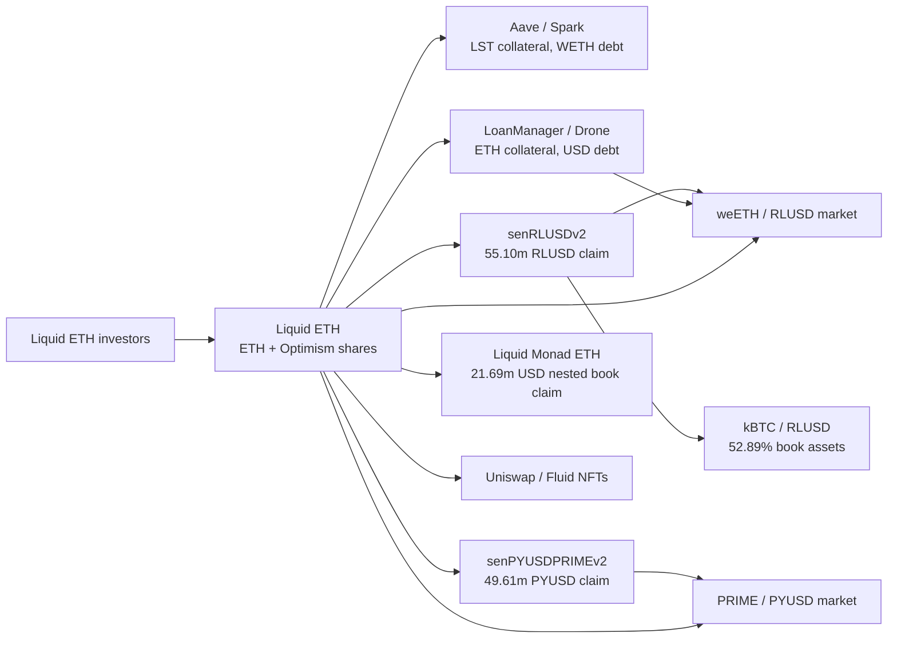
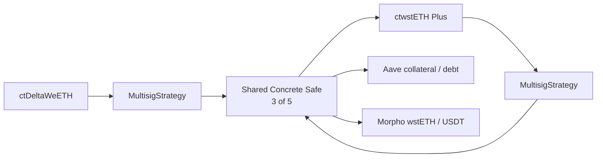

# How products share assets, borrowers and control

These diagrams map selected relationships verified at T. An arrow can represent ownership, contract control, lending or a claim on another product. It does not automatically mean that new money was deposited or that a cash transfer took place.

The investor arrow describes the role of investors; it is not a complete census of share holders. RLUSD and PYUSD claims assume that one unit is worth one dollar. Part of the lending and borrowing overlaps: Liquid ETH borrows from markets that it also funds through its carry vaults. Some interest therefore returns to the same investor. Measure the net cash flow after fees rather than adding income from both sides.

The Safe holds every ctwstETH Plus share. The vault's `totalAssets` figure alone cannot establish outside investor capital: the origin of those shares and the assets backing them must also be identified. The Aave and Morpho positions have not been fully allocated between the two vaults. A separate single address holds all ctDelta shares; its ultimate economic owner remains unidentified.

`data/eth/dependency_graph.json` and `carry_credit_lookthrough.json` record the evidence and type of each relationship. These related balances cannot be added as separate market capital. Contract getters establish specific on-chain links. The off-chain credit relationships rely on disclosures and do not prove legal recovery rights.

Backing, strategy deployment and share circulation can be on different chains. A lock/mint bridge keeps an original token in escrow and creates a remote claim. A burn/mint bridge destroys shares on one chain and issues them on another. A product can use both methods. To count capital once, identify each asset and any messages still in transit.

Symbols help find candidates, but a token's identity requires its chain, address, version, backing and redemption path. Some APIs flag `misrepresentedTokens=true`. For example, ether.fi Liquid's adapter reports synthetic eETH/WETH amounts by internal category. Those rows describe accounting allocations, not physical tokens in a wallet.

A reliable global total requires the complete ownership and debt map. Keep book claims, oracle-valued accounts, gross pool TVL and native ETH backing separate until their overlaps are reconciled. An unresolved relationship is neither assumed to be zero nor treated as a verified outside deposit.
